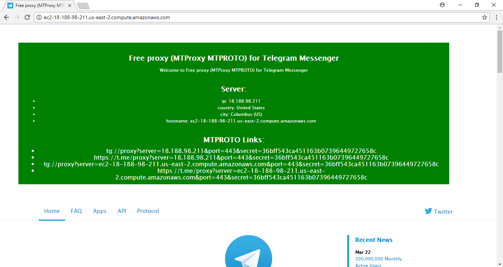

# MTProxy mtproto-proxy mtproto-proxy-server

## FREE MTPROTO proxy for Telegram

> [FREE MTPROTO proxy for Telegram tg ip link](tg://proxy?server=18.188.98.211&port=443&secret=36bff543ca451163b07396449727658c)
> [FREE MTPROTO proxy for Telegram t.me ip link](https://t.me/proxy?server=18.188.98.211&port=443&secret=36bff543ca451163b07396449727658c)

or

> [FREE MTPROTO proxy for Telegram tg hostname link](tg://proxy?server=ec2-18-188-98-211.us-east-2.compute.amazonaws.com&port=443&secret=36bff543ca451163b07396449727658c)
> [FREE MTPROTO proxy for Telegram t.me hostname link](https://t.me/proxy?server=ec2-18-188-98-211.us-east-2.compute.amazonaws.com&port=443&secret=36bff543ca451163b07396449727658c)


## Installing

```bash
git clone https://github.com/an-ivannikov/mtproto-proxy-server.git
cd mtproto-proxy-server
sudo sh ./install.sh
```

## Register your proxy with [@MTProxybot](tg://resolve?domain=@MTProxybot) on [Telegram](https://www.telegram.org).

> host:port
> mtproto-secret

## Activate promotion

```bash
echo "proxy-tag from @MTProxybot" > /var/www/mtproto-proxy/proxy-tag
cd /var/www/mtproto-proxy-server
sudo sh ./scripts/mtproto-proxy-install-service.sh
```
